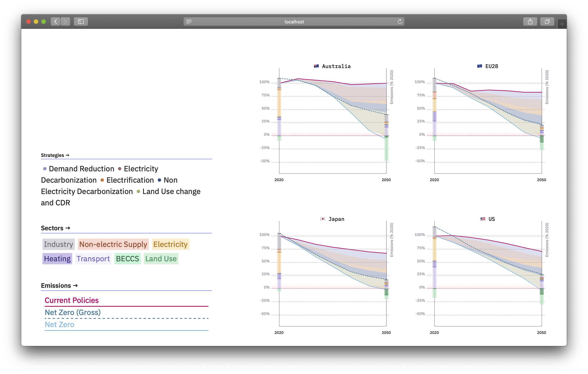

# Net-Zero Pathways for Industrialized Countries
This repository contains the code for [*Transition Risks – Net-Zero Pathways for Industrialized Countries*](https://climatescenarios.org/countries-pathways), a learn module focusing on possible decarbonization strategies for a selection of economies. It is part of the [SENSES Toolkit](https://climatescenarios.org/).



## License

The source code is licensed under the [ISC license](LICENSE.md). Text and graphics are licensed under [Attribution-ShareAlike 4.0 International](https://creativecommons.org/licenses/by-sa/4.0/). For licensing information on datasets please refer to the data sources section. Exceptions are listed below on a per-file basis.

## Data Sources

Data sources and if applicable licenses are listed below on a per-file basis.

- `src/assets/data/GlobalStrategy.json` No license applicable Source: [Schreyer, F., Luderer, G., Rodrigues, R., Pietzcker, R. C., Baumstark, L., Sugiyama, M., Brecha, R. J., & Ueckerdt, F. (2020). Common but differentiated leadership: Strategies and challenges for carbon neutrality by 2050 across industrialized economies. Environmental Research Letters, 15(11), 114016.](https://iopscience.iop.org/article/10.1088/1748-9326/abb852)

## Project setup
```
npm install
```

### Compiles and hot-reloads for development
```
npm run serve
```

### Compiles and minifies for production
```
npm run build
```

### Lints and fixes files
```
npm run lint
```

### Customize configuration
See [Configuration Reference](https://cli.vuejs.org/config/).
